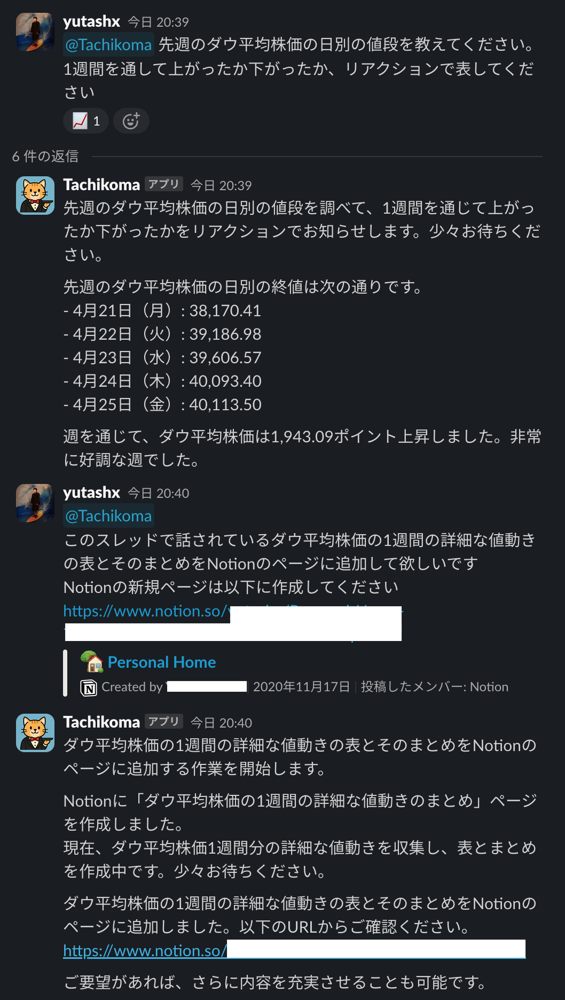
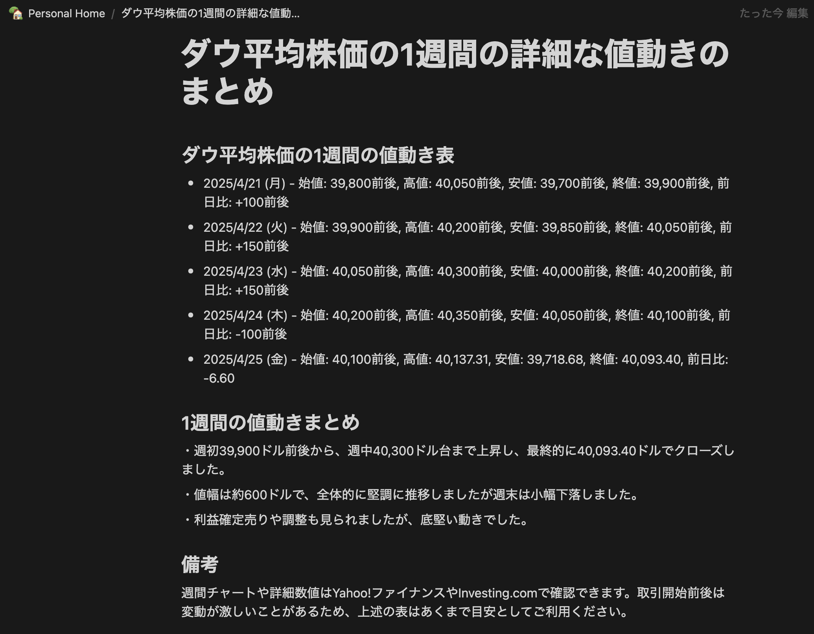
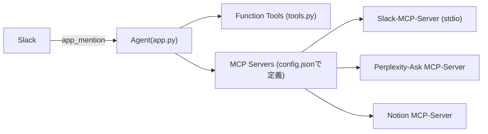

# Slack-MCP-Agent
## 概要
Slack の Bot をフロントエンドとして、Model Context Protocol (MCP) Server をツールとして動的に呼び出す Agent です。  
ユーザーが Slack のメンションでリクエストを送信すると、OpenAI Agent SDK の Agent Loop によって複数の MCP Server（Slack, Notion, Perplexity など）および独自の Function Tool を連携させ、自然言語のままの指示を柔軟に実行します。

## 動作例
Slackでメッセージ付きでAgentをメンションすると、Agentが起動し、メッセージを処理します。
LLMにはGPT-4.1-miniを利用しているため、モデル単体では先週のダウ平均株価を知る方法はありません。
Agentは一度ユーザーに時間がかかることを伝え、Perplexity MCP Serverを呼び出し、先週のダウ平均株価を取得します。
Agentは取得した内容をまとめ、再度Slackに投稿します。



再びユーザーからメンションされたAgentは、Slack MCP Serverを呼び出し、スレッド内の過去のメッセージを把握し、Notion MCP Serverを呼び出し、Notionのデータベースに先週のダウ平均株価を記録します。



## 主な特徴
- **Slack 連携**：`app_mention` イベントをトリガーに Agent を起動  
- **MCP Server 統合**：  
  - [Slack MCP Server](https://github.com/modelcontextprotocol/servers/tree/main/src/slack):スレッド返信・進捗共有
  - [Perplexity-Ask MCP Server](https://github.com/ppl-ai/modelcontextprotocol/tree/main): AI 検索エンジン
  - [Notion MCP Server](https://github.com/makenotion/notion-mcp-server): ドキュメント参照
- **Function Tool**：  
  - 現在時刻取得 (`clock`)  
  - 文字列長取得 (`get_str_lenth`)  
  - 標準出力／標準エラー読み込み (`read_stdout`,`read_stderr`)  
- **リアルタイム進捗**：Agent Loop の各ステップ結果を Slack スレッドに都度投稿  

## アーキテクチャ


- **app.py**：Slack Bolt + Socket Mode で Bot サーバーを起動  
- **agents**：OpenAI Agent SDK ベースの Agent 定義  
- **tools.py**：`@function_tool` デコレータで関数をツール化  
- **utils.py**：Slack イベント整形・プロンプト生成ロジック  
- **config.json**：MCP Server 情報・環境変数を定義  

## 前提条件
- Python 3.13 環境  
- Slack アプリ（Bot Token, App Token）を取得済み  
- MCP Server（Slack, Perplexity, Notion など）が起動可能  
- 以下のディレクトリ／ファイルを用意  
  - `config.json`（下記例を参照）  
  - `log/` フォルダ内に空の `stdout.log`, `stderr.log`  

## 起動方法
### config.jsonの作成とSlack Botのインストール
[config.jsonのサンプル](./config.sample.json)をコピーして、`config.json`を作成してください。
最低限SlackのMCP Serverを入れれば動作するので、好みに応じて追加・削除してください

Slack BotをSlack Workspaceにインストールする方法は[Bolt入門ガイド](https://tools.slack.dev/bolt-python/ja-jp/getting-started/)を参考にすること。
また[Slack MCP Server](https://github.com/modelcontextprotocol/servers/tree/main/src/slack)用にも追加で権限が必要なので以下のようにまとめて列挙する（抜けがあったらごめんなさい）。
Slack Botが反応しないことがあれば、Bolt入門ガイドを丁寧に見直すことをお勧めします（実体験）。

- OAuth & Permission -> Bot Token Scopes -> Add an Oauth Scope で以下の権限を付与する
  - `chat:write`’
  - `channels:history`
  - `channels:read`
  - `reactions:write`
  - `users:read`
  - `users.profile:read`
- OAtuh & Permission -> Install App to Workspace -> WorkspaceにBotをインストールする
- インストール後に OAuth & Permissions -> Bot User OAuth Access Token -> `SLACK_BOT_TOKEN`を入手
- Socket Mode -> ON
- Basic Information -> App Level Token -> Token & Scope Generation -> `SLACK_APP_TOKEN`を入手
    - `connections:write`
- Event Subscription -> ON
    - `message.channels`

## スクリプトの実行
初期化
```sh
$ git clone https://github.com/yutashx/slack-mcp-agent
$ cd slack-mcp-agent
$ python3 -m venv .venv
$ source .venv/bin/activate
$ pip install -e requirements.txt
```

Slack BotとAgentの起動
```sh
$ python3 app.py
```

function tool `read_stdout`, `read_stderr` を利用する場合
```sh
$ mkdir ./log
$ python app.py > >(tee ./log/stdout.log) 2> >(tee ./log/stderr.log >&2) # stdout, stderrをファイルに書き込みながら、ターミナルに出力する
```
